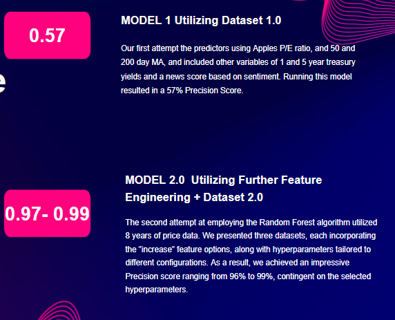

# Portfolio Optimization Analyst Rating


## Unlocking Insights 2.0: A Cutting-Edge Approach to Sell-Side Equity Research with Advanced Machine Learning Models

[INSERT SCREENSHOT OF THE TITLE SLIDE HERE SIMILAR TO BELOW]


This file will explore Portfolio Optimization utilizing the Efficient Frontier, as well as Machine Learning to determine the optimal weights of assets in a portfolio. The portfolio contains eight assets: GLD (Gold), VNQ (Real Estate), USO (Oil Commodity), K (Consumer Staple), AAPL (Tech), TSLA (Tech), AGG (Investment Grade Bonds), JNK (Junk Bonds). We look to the risk/return tradeoff using two portfolio options: the Sharpe optimized portfolio, as well as the minimum volatility (low risk) portfolio. We utilize two categories of indicators: technical (moving averages, price changes, etc.) as well as macro indicators (yield curve). Finally, we utilize four predictive machine learning models: the random forest, the logistic regression, the neural network, and the XGBoost algorithm. 

[INSERT SCREENSHOT OF THE FLOWCHART HERE]

## Usage: 

> Note: `PortOp_Analyst_Rating` is found in the main folder. Datasets, code for models, etc. are found in the branch Folder.

### Import the following libraries and dependencies: 
```
import pandas as pd
from sklearn.model_selection import train_test_split
from xgboost import XGBClassifier
from sklearn.metrics import accuracy_score
import pandas as pd
from pathlib import Path
import tensorflow as tf
from tensorflow.keras.layers import Dense
from tensorflow.keras.models import Sequential
from keras.utils import to_categorical
from sklearn.model_selection import train_test_split
from sklearn.preprocessing import StandardScaler,OneHotEncoder
import pandas as pd
import seaborn as sns
import matplotlib.pyplot as plt
import matplotlib.pyplot as plt
from matplotlib_venn import venn2
import numpy as np
```

### Read and open `max_rating.csv` and `min_rating.csv` for the four models (XGBoost, Neural Network, RandomForest, LogisticRegression) 
```# Read the applicants_data.csv file from the Resources folder into a Pandas DataFrame
df = df = pd.read_csv("max_rating.csv")

# Review the DataFrame
df
```

## Usage for `max_rating.csv` and `min_rating.csv`:

[INSERT DATA MANIPULATION PROCESS HERE] 

For example: 

```python
# Pull aapl ticker with date range "03/32/2023" to "07/03/2023"
aapl_1 = yf.download("AAPL", start='2023-03-31', end='2023-07-03', interval="1d")

aapl_1['Total Debt'] = aapl_debt.loc['2023-03-31']
aapl_1['Shares'] = aapl_shares.loc['2023-03-31']
aapl_1['Cash'] = aapl_cash.loc['2023-03-31']
aapl_1['EPS'] = 1.53
aapl_1['EBITDA'] = 31260000000
```

> Note: EPS and EBITDA were hard-coded into the data frame. You can view these values in Yahoo Finance. 

## Dataset Building: 

[INSERT DETAILS ABOUT DATASET BUILDING HERE]

Now that we have built out the primary dataset, we can begin to use Machine Learning to build a predictive classification model.


## The Efficient Frontier: 

[INSERT THE EFFICIENT FRONTIER CODE AND INTRODUCTION HERE]

```python
# Call pipeline to run `sentiment-analysis`
classifier = pipeline('sentiment-analysis')
```

## The Efficient Frontier 2.0: 

[INSERT THE EFFICIENT FRONTIER 2.0 CODE AND INTRODUCTION HERE]

```python
# Call pipeline to run `sentiment-analysis`
classifier = pipeline('sentiment-analysis')
```
## Exploratory Data Analysis: Distribution of Key Variables



Our first attempt the predictors using Apples P/E ratio, and 50 and 200 day MA, and included other variables of 1 and 5 year treasury yields and a news score based on sentiment. Running this model resulted in a 57% Precision Score. The second Random Forest attempt using 23 years of price data with predictors of daily Apple; volume, open, high, low and close prices resulted in a 55% Precision score.

```
#Imprt Random Forest
from sklearn.ensemble import RandomForestClassifier
```
```
#initial model, n_estimators = number of decision trees, min_sample_spit protects from overfitting, 
#random_state =1 to be able to re-run model with same results. train = -100 is all rows except last 100 rows.
model = RandomForestClassifier(n_estimators=175, min_samples_split=100, random_state=1)
train = data.iloc[:-100]
test = data.iloc[-100:]
#predictors used
predictors = ["Close", "Open", "High", "Low", "Volume"]
model.fit(train[predictors], train["Signal"])

## Exploratory Data Analysis: Time Series


Our first attempt the predictors using Apples P/E ratio, and 50 and 200 day MA, and included other variables of 1 and 5 year treasury yields and a news score based on sentiment. Running this model resulted in a 57% Precision Score. The second Random Forest attempt using 23 years of price data with predictors of daily Apple; volume, open, high, low and close prices resulted in a 55% Precision score.

## Exploratory Data Analysis: Pairplot


Our first attempt the predictors using Apples P/E ratio, and 50 and 200 day MA, and included other variables of 1 and 5 year treasury yields and a news score based on sentiment. Running this model resulted in a 57% Precision Score. The second Random Forest attempt using 23 years of price data with predictors of daily Apple; volume, open, high, low and close prices resulted in a 55% Precision score.

## Exploratory Data Analysis: Pairwise Correlation Heatmap


Our first attempt the predictors using Apples P/E ratio, and 50 and 200 day MA, and included other variables of 1 and 5 year treasury yields and a news score based on sentiment. Running this model resulted in a 57% Precision Score. The second Random Forest attempt using 23 years of price data with predictors of daily Apple; volume, open, high, low and close prices resulted in a 55% Precision score.

```
#Imprt Random Forest
from sklearn.ensemble import RandomForestClassifier
```
```
#initial model, n_estimators = number of decision trees, min_sample_spit protects from overfitting, 
#random_state =1 to be able to re-run model with same results. train = -100 is all rows except last 100 rows.
model = RandomForestClassifier(n_estimators=175, min_samples_split=100, random_state=1)
train = data.iloc[:-100]
test = data.iloc[-100:]
#predictors used
predictors = ["Close", "Open", "High", "Low", "Volume"]
model.fit(train[predictors], train["Signal"])


```
#Imprt Random Forest
from sklearn.ensemble import RandomForestClassifier
```
```
#initial model, n_estimators = number of decision trees, min_sample_spit protects from overfitting, 
#random_state =1 to be able to re-run model with same results. train = -100 is all rows except last 100 rows.
model = RandomForestClassifier(n_estimators=175, min_samples_split=100, random_state=1)
train = data.iloc[:-100]
test = data.iloc[-100:]
#predictors used
predictors = ["Close", "Open", "High", "Low", "Volume"]
model.fit(train[predictors], train["Signal"])


```
#Imprt Random Forest
from sklearn.ensemble import RandomForestClassifier
```
```
#initial model, n_estimators = number of decision trees, min_sample_spit protects from overfitting, 
#random_state =1 to be able to re-run model with same results. train = -100 is all rows except last 100 rows.
model = RandomForestClassifier(n_estimators=175, min_samples_split=100, random_state=1)
train = data.iloc[:-100]
test = data.iloc[-100:]
#predictors used
predictors = ["Close", "Open", "High", "Low", "Volume"]
model.fit(train[predictors], train["Signal"])


## XGBoost Model: 


Our first attempt the predictors using Apples P/E ratio, and 50 and 200 day MA, and included other variables of 1 and 5 year treasury yields and a news score based on sentiment. Running this model resulted in a 57% Precision Score. The second Random Forest attempt using 23 years of price data with predictors of daily Apple; volume, open, high, low and close prices resulted in a 55% Precision score.

```
#Imprt Random Forest
from sklearn.ensemble import RandomForestClassifier
```
```
#initial model, n_estimators = number of decision trees, min_sample_spit protects from overfitting, 
#random_state =1 to be able to re-run model with same results. train = -100 is all rows except last 100 rows.
model = RandomForestClassifier(n_estimators=175, min_samples_split=100, random_state=1)
train = data.iloc[:-100]
test = data.iloc[-100:]
#predictors used
predictors = ["Close", "Open", "High", "Low", "Volume"]
model.fit(train[predictors], train["Signal"])

## RandomForest Model: 


Our first attempt the predictors using Apples P/E ratio, and 50 and 200 day MA, and included other variables of 1 and 5 year treasury yields and a news score based on sentiment. Running this model resulted in a 57% Precision Score. The second Random Forest attempt using 23 years of price data with predictors of daily Apple; volume, open, high, low and close prices resulted in a 55% Precision score.

```
#Imprt Random Forest
from sklearn.ensemble import RandomForestClassifier
```
```
#initial model, n_estimators = number of decision trees, min_sample_spit protects from overfitting, 
#random_state =1 to be able to re-run model with same results. train = -100 is all rows except last 100 rows.
model = RandomForestClassifier(n_estimators=175, min_samples_split=100, random_state=1)
train = data.iloc[:-100]
test = data.iloc[-100:]
#predictors used
predictors = ["Close", "Open", "High", "Low", "Volume"]
model.fit(train[predictors], train["Signal"])
```

```
#create prediction function to put everythin into one function
def predict(train, test, predictors, model):
    model.fit(train[predictors], train["Signal"])
    preds = model.predict(test[predictors])
    preds = pd.Series(preds, index=test.index, name="Predictions")
    combined = pd.concat([test["Signal"], preds], axis=1)
    return combined
```

```
#Backtest function that considers the AAPL data, the ML Model, predictors, a start value and step value (15 years and yearly)  
def backtest(data, model, predictors, start=3750, step=250):
    all_predictions = []
    
    #create function to loop through data year by year
    #train year is all years prior to the current year, test set is current year and then concat all prodiction together
    
    for i in range(start, data.shape[0], step):
        train = data.iloc[0:i].copy()
        test = data.iloc[i:(i+step)].copy()
        predictions = predict(train, test, predictors, model)
        all_predictions.append(predictions)
    return pd.concat(all_predictions)
```
Improve the model with extra predictor columns using rolling moving averages using weekly, monthly, quarterly, yearly, and 2 years.
compare ratios of todays closing price vs calculated averages
create new columns for new predictions
```
horizons = [2,5,60,250,800]
new_predictors = []

for horizon in horizons:
    rolling_averages = data.rolling(horizon).mean()
    
    ratio_column = f"Close_Ratio_{horizon}"    
    data[ratio_column] = data["Close"] / rolling_averages["Close"]
    
    trend_column = f"Trend_{horizon}"
    data[trend_column] = data.shift(1).rolling(horizon).sum() ["Signal"]
    
    new_predictors += [ratio_column, trend_column]
```
insert control to what becomes one and what becomes a zero by adding the probability to 55% to increase the probability 
when we say the price will go up we are more confident which will reduce the number of trading days.+
```
def predict(train, test, predictors, model):
    model.fit(train[predictors], train["Signal"])
    preds = model.predict_proba(test[predictors])[:,1]
    preds[preds >= .55] = 1
    preds[preds < .55] = 0
    preds = pd.Series(preds, index=test.index, name="Predictions")
    combined = pd.concat([test["Signal"], preds], axis=1)
    return combined
```

New precision score
```
precision_score(predictions["Signal"], predictions["Predictions"])
```

Plot the closing price history
```
data.plot.line(y="Close", use_index=True)
```

## LogisticRegression Model: 


Using 'EBIDTA', 'EV/EBITDA', 'EPS', 'P/E', '1 YR', '5 YR', '30 YR', '50 MA', '200 MA', 'News', 'News Score', 'Percent Change', 'Target - B/H/S (based on close - daily % change). We had to change the news and target columns  to numerical values  so that the model would be able to accept the data.

```
# Select features and target variable
X = df.drop(columns=["Target - B/H/S (based on close - daily % change)"])
y = df["Target - B/H/S (based on close - daily % change)"]

# Split the data into training and testing sets
train_size = int(len(X) * 0.8)
X_train, X_test = X[:train_size], X[train_size:]
y_train, y_test = y[:train_size], y[train_size:]

# Create a pipeline for preprocessing and modeling
pipeline = Pipeline([
    ("scaler", StandardScaler()),
    ("model", LogisticRegression())
])

# Define the hyperparameters grid for grid search
param_grid = {
    "model__C": [0.1, 1.0, 10.0],
    "model__penalty": ["l1", "l2"],
}

# Perform grid search for hyperparameter tuning
grid_search = GridSearchCV(pipeline, param_grid, cv=3)
grid_search.fit(X_train, y_train)

# Get the best model
best_model = grid_search.best_estimator_

# Evaluate the model on training data
y_train_pred = best_model.predict(X_train)
train_report = classification_report(y_train, y_train_pred)
print("Training Report:")
print(train_report)

# Evaluate the model on testing data
y_test_pred = best_model.predict(X_test)
test_report = classification_report(y_test, y_test_pred)
print("Testing Report:")
print(test_report)
```

## NeuralNetwork Model: 


After backtesting and manual optimization, we found the neural network to be less than ideal for predicting the correct BUY or SELL classification. We utilized 2 models. The first model yielded an accuracy score of 0.4701, while the second model gave 0.5203 accuracy score. The difference between the first two models can be found within the hyperparameter tuning. For example, we changed the loss function from Categorical Cross-Entropy to Mean Squared Error, number of hidden nodes from 10 to 20, number of neurons form 2 to 3, and optimizer function from sigmoid to adam. 

Model 1
```
# Compile the Sequential model
nn.compile(loss="binary_crossentropy", optimizer="sigmoid", metrics=["accuracy"])
fit_model = nn.fit(X_train_scaled, y_train, epochs = 50)
```
Model 2
```
# Compile the Sequential model
nn.compile(loss="mean_squared_error", optimizer="adam", metrics=["accuracy"])
fit_model = nn.fit(X_train_scaled, y_train, epochs = 50)
```
## [INSERT STREAMLIT HERE]

 [INSERT STREAMLIT EXPLANATION OF RESULTS HERE]

## Next Steps 


We found this classification problem to be very interesting, and found that there were many opportunities to further enhance our model:

* More intricate trading algorithm by incorporating further complexity to enhance predictions 
* News sentiment, technical indicators, fundamental indicators, etc. 
* Enhancing feature engineering and selection for all three ML models 
* fundamental, technical, and macro to improve predictive accuracy
* More hyperparameter tuning with the Neural Network
* experimenting with different optimizers, loss, activation functions, and the number of epochs 


## SOURCES:

* https://www.machinelearningplus.com/machine-learning/exploratory-data-analysis-eda/
* https://www.youtube.com/watch?v=gfwNK3o45ng
* https://towardsdatascience.com/is-it-possible-to-predict-stock-prices-with-a-neural-network-d750af3de50b

