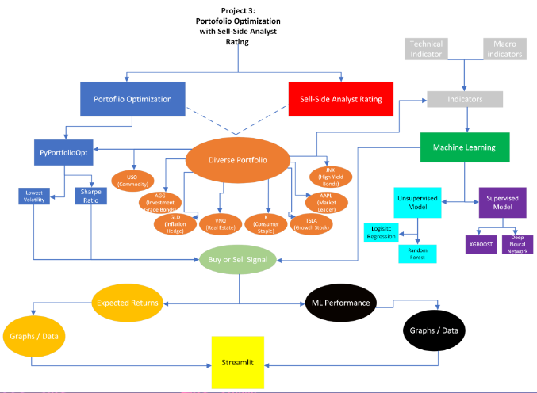
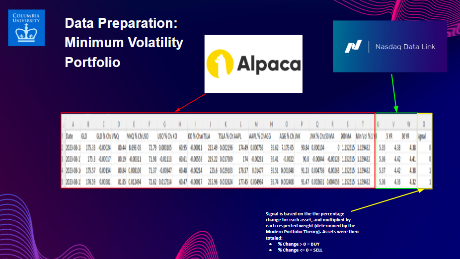
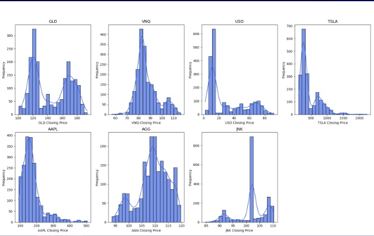
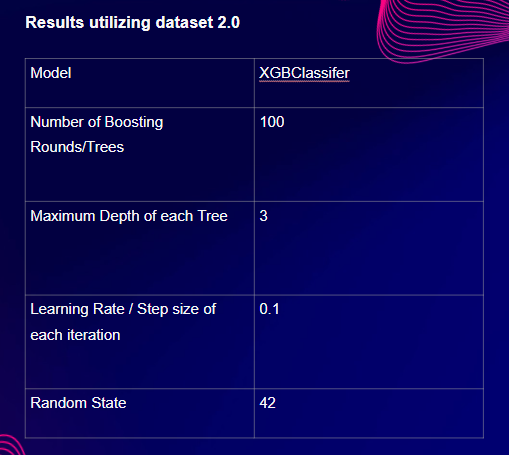

# Portfolio Optimization Analyst Rating

## Unlocking Insights 2.0: A Cutting-Edge Approach to Sell-Side Equity Research with Advanced Machine Learning Models


This file will explore Portfolio Optimization utilizing the Efficient Frontier, as well as Machine Learning to determine the optimal weights of assets in a portfolio. The portfolio contains eight assets: GLD (Gold), VNQ (Real Estate), USO (Oil Commodity), K (Consumer Staple), AAPL (Tech), TSLA (Tech), AGG (Investment Grade Bonds), JNK (Junk Bonds). We look to the risk/return tradeoff using two portfolio options: the Sharpe optimized portfolio, as well as the minimum volatility (low risk) portfolio. We utilize two categories of indicators: technical (moving averages, price changes, etc.) as well as macro indicators (yield curve). Finally, we utilize four predictive machine learning models: the random forest, the logistic regression, the neural network, and the XGBoost algorithm. 



## Usage: 

> Note: `PortOp_Analyst_Rating` is found in the main folder. Since there are two portfolios, two Python scripts have been created for organization purposes: `max_rating.ipynb` and `min_rating.ipynb`.
>`max_rating.ipynb` is the Sharpe Ratio Portfolio. That is the risk-adjusted reward portfolio. 
​
`min_rating.ipynb` is the Minimum Volatility Portfolio. That is the lowest risk level with expected positive annualized returns. 
​
The below will only view, the `max_rating.ipynb` since both codes are the same with the only difference being the weights given to each asset in the portfolio. 

### Import the following libraries and dependencies: 
```
import pandas as pd
from sklearn.model_selection import train_test_split
from xgboost import XGBClassifier
from sklearn.metrics import accuracy_score
import pandas as pd
from pathlib import Path
import tensorflow as tf
from tensorflow.keras.layers import Dense
from tensorflow.keras.models import Sequential
from keras.utils import to_categorical
from sklearn.model_selection import train_test_split
from sklearn.preprocessing import StandardScaler,OneHotEncoder
import seaborn as sns
import matplotlib.pyplot as plt
from matplotlib_venn import venn2
import numpy as np
```

### Read and open `max_rating.csv` and `min_rating.csv` for the four models (XGBoost, Neural Network, RandomForest, LogisticRegression) 
```# Read the applicants_data.csv file from the Resources folder into a Pandas DataFrame
df = df = pd.read_csv("max_rating.csv")

# Review the DataFrame
df
```
## Dataset Building: 

Now to build the dataset. Please see the below code which highlights this process. 
```
​
Get % Change for each asset
​
```python
# Get % change on closing price
df_returns = df.pct_change()
​
# Change names to 'Ticker % Change'
df_returns.columns = ['GLD % Change', 'VNQ % Change', 'USO % Change', 'KO % Change', 'TSLA % Change', 'AAPL % Change', 'AGG % Change', 'JNK % Change'] 
df_returns.head()
```
​
Create weighted accumulated % change
```python
## Multiply the weights for each asset, combine into new dataframe, and sum to get total value.
​
# GLD Weight
df_max_gld = 0.2492 * df_returns["GLD % Change"]
df_max_gld = pd.DataFrame(df_max_gld)
​
# VNQ Weight 
df_max_vnq = 0.0036 * df_returns["VNQ % Change"]
df_max_vnq = pd.DataFrame(df_max_vnq)
​
# USO Weight 
df_max_uso = 0.0611 * df_returns["USO % Change"]
df_max_uso = pd.DataFrame(df_max_uso)
​
# KO Weight 
df_max_ko = 0.1763 * df_returns["KO % Change"]
df_max_ko = pd.DataFrame(df_max_ko)
​
# TSLA Weight 
df_max_tsla = 0.2276 * df_returns["TSLA % Change"]
df_max_tsla = pd.DataFrame(df_max_tsla)
​
# AAPL Weight 
df_max_aapl = 0.197 * df_returns["AAPL % Change"]
df_max_aapl = pd.DataFrame(df_max_aapl)
​
# AGG Weight 
df_max_agg = 0.0838 * df_returns["AGG % Change"]
df_max_agg = pd.DataFrame(df_max_agg)
​
# JNK Weight 
df_max_jnk = 0.0015 * df_returns["JNK % Change"]
df_max_jnk = pd.DataFrame(df_max_jnk)
​
# Concat the weighted assets 
df_max = pd.concat([df_max_gld, df_max_vnq, df_max_uso, df_max_ko, df_max_tsla, df_max_aapl, df_max_agg, df_max_jnk],1)
df_max.head()
​
#Find sum accross timestamp index 
df_max_sum = df_max.sum(1)
d = {"Weighted Total % Change" : df_max_sum}
df_max_sum = pd.DataFrame(data = d)
display(df_max_sum.tail())
display(df_max_sum.head())
```
​
​
Add U.S. Treasury Indicators
​
```python
# Read in the US Treasury Data
us_treasury = pd.read_csv(
    Path("Resources/USTREASURY-YIELD (2).csv"),
    index_col = "Date"
    # infer_parse_dates = True
)
​
# Grab the equivalent dates of basket portfolio 
us_treasury_df = us_treasury["2023-08-18" : "2015-12-01"]
```
​
Get Technical Indicators
​
```python
# Set Short (50) and Long Window (200)
​
short_window = 50
long_window = 200
​
df_max['50 MA'] = cum_returns_max.rolling(window=short_window).mean()
df_max['200 MA'] = cum_returns_max.rolling(window=long_window).mean()
```
​
Create BUY or SELL Signal 
​
```python
# Create empty list and append a 'Buy' or 'Sell' signal 
​
rec = []
for i in df_max['Max Sharpe % Change By Weights']:
    if i > 0.0:
        rec.append(1)
    else:
        rec.append(0)
​
# Create 'Recommendation column and assign 'rec' variable to it
​
df_max['Recommendation'] = rec
```
​
Concat the New Data with Technical, Buy/Sell Signal, and U.S. Treasury Indicators
​
```python
df_max = pd.concat([df_max, us_trs], 1)
```
​
​
Use SimpleImputer to fill in all NaN values to preserve data
​
```python
# Replace NaN values with SimpleImputer. Fit and Transform this data.
imp_mean = SimpleImputer(missing_values=np.nan, strategy='mean')
df_max = imp_mean.fit_transform(df_max)
​
```
​
Finally, export to a CSV file for Machine Learning Scripts!
​
```python
df_max.to_csv('max_rating.csv')
```

Now that we have built out the primary dataset, we can begin to use Machine Learning to build a predictive classification model.



## The Efficient Frontier: 


The efficient frontier is a concept in the modern portfolio theory that represents the optimal combination of assets that maximizes expected returns for a given level of risk OR minimizes risk for a given level of expected returns. It shows the range of possible portfolios that offer the best trade-off between risk and reward, to help investors optimize based on their risk tolerance.

```# Grab the Alpaca API Key
#alpaca_api_key = os.environ.get('PKT9GZRNU8ZZ0UAWZ5I3')
# alpaca_secret_key = os.environ.get('JNKg1fGpTBYCJlCaCueN3vnfKZOK39VhhfO6DKDE')
alpaca_api_key = "PK46ENRTMXPI1M3W2IIP"
alpaca_secret_key = 'NnKfZWkUa7UzL64qsKFAbX4BiJWSM6cycdzUW4Jx'
​
# Create the Alpaca tradeapi.REST object
alpaca = tradeapi.REST(alpaca_api_key, alpaca_secret_key, api_version = "v2")
​
# Set the tickers for Technology - XLK, Health Care - XLV, Financials - XLF,
# Real Estate - XLRE, Energy - XLE, Materials - XLB, Communication - XLC, 
# Consumer Discretionary - XLY, Consumer Staples - XLP, 
# Industrials - XLI, Utilities - XLU
​
tickers = ["GLD", "VNQ", "USO", "KO", "TSLA", "AAPL", "AGG", "JNK"]
​
# Set timeframe to 1Day
timeframe = '1D'
​
# Format current date as ISO format
# Set both the start and end date at the date of your prior weekday 
# 9+1 to backtest data
start_date = pd.Timestamp("2015-08-01", tz="America/New_York").isoformat()
end_date = pd.Timestamp("2023-08-01", tz="America/New_York").isoformat()
​
# Use the Alpaca get_bars function to get current closing prices the portfolio
# Be sure to set the `df` property after the function to format the response object as a DataFrame
​
portfolio_data = alpaca.get_bars(
    tickers, 
    timeframe,
    start = start_date,
    end = end_date
).df
​
# portfolio_data
​
# The below will generate the Efficient Frontier,
​
# We will plot and meausure the Sharpe Ratio by generating randomly weighted portfolios 
# We will then take the sum of the mean returns generated by the assets in a trading year (252 days)
# Then, we will calculate the standard deviation of each portfolio
​
def portfolio_annualized_performance(weights, mean_returns, cov_matrix):
    returns = np.sum(mean_returns * weights) * 252
    std = np.sqrt(np.dot(weights.T, np.dot(cov_matrix, weights))) * np.sqrt(252)
    return std, returns
​
    def random_portfolios(num_portfolios, mean_returns, cov_matrix, risk_free_rate):
    results = np.zeros((3, num_portfolios))
    n_assets = len(mean_returns)
    weights_record = []
    for i in range(num_portfolios):
        weights = np.random.random(n_assets)
        weights /= np.sum(weights)
        weights_record.append(weights)
        portfolio_std_dev, portfolio_return = portfolio_annualized_performance(weights, mean_returns, cov_matrix)
        results[0,i] = portfolio_std_dev
        results[1,i] = portfolio_return
        results[2,i] = (portfolio_return - risk_free_rate) / portfolio_std_dev
        print(portfolio_return)
    return results, weights_record
​
# inputs for above variables
# NOTE: For the risk free rate, we are using the 10 year treasury yield at the time the data was pulled
# which is 3.44% 
​
returns = df.pct_change()
mean_returns = returns.mean()
cov_matrix = returns.cov()
num_portfolios = 25000
risk_free_rate = 0.034
​
def display_simulated_ef_with_random(mean_returns, cov_matrix, num_portfolios, risk_free_rate):
    results, weights = random_portfolios(num_portfolios, mean_returns, cov_matrix, risk_free_rate)
    
    max_sharpe_idx = np.argmax(results[2])
    sdp, rp = results[0, max_sharpe_idx], results[1, max_sharpe_idx]
    max_sharpe_allocation = pd.DataFrame(weights[max_sharpe_idx], index=df.columns, columns=['allocation'])
    max_sharpe_allocation.allocation = [round(i * 100, 2) for i in max_sharpe_allocation.allocation]
    max_sharpe_allocation = max_sharpe_allocation.T
    
    min_vol_idx = np.argmin(results[0])
    sdp_min, rp_min = results[0, min_vol_idx], results[1, min_vol_idx]
    min_vol_allocation = pd.DataFrame(weights[min_vol_idx], index=df.columns, columns=['allocation'])
    min_vol_allocation.allocation = [round(i * 100, 2) for i in min_vol_allocation.allocation]
    min_vol_allocation = min_vol_allocation.T
    
    print ("-" * 80)
    print("Maximum Sharpe Ratio Portfolio Allocation\n")
    print("Annualized Return:", round(rp, 2))
    print("Annualized Volatility:", round(sdp, 2))
    print("\n")
    print(max_sharpe_allocation)
    
    print ("-" * 80)
    print("Minimum Volatility Portfolio Allocation\n")
    print("Annualized Return:", round(rp_min, 2))
    print("Annualized Volatility:", round(sdp, 2))
    print("\n")
    print(min_vol_allocation)
    
    plt.figure(figsize=(10, 7))
    plt.scatter(results[0, :], results[1, :], c=results[2, :], cmap='YlGnBu', marker='o', s=10, alpha=0.3)
    plt.colorbar()
    plt.scatter(sdp, rp, marker='*', color='r', s=500, label='Maximum Sharpe Ratio')
    plt.scatter(sdp_min,rp_min,marker='*',color='g',s=500, label='Minimum volatility')
    plt.title('Simulated Portfolio Optimization based on Efficient Frontier')
    plt.xlabel('annualized volatility')
    plt.ylabel('annualized returns')
    plt.legend(labelspacing=0.8)
​
    # To display frontier and data:
#mean_returns, cov_matrix, num_portfolios, risk_free_rate
​
display_simulated_ef_with_random(mean_returns, cov_matrix, num_portfolios, risk_fr
                                
# The table below includes the weights for both portfolio options and (Shape and Minimum Risk)
https://files.slack.com/files-pri/T04N7AM0XJB-F05PGJ32222/screen_shot_2023-08-26_at_11.55.49_am.png
​
# Below, you will find the final result of the efficient frontier 
https://files.slack.com/files-pri/T04N7AM0XJB-F05PP4SH1LK/screen_shot_2023-08-26_at_11.56.57_am.png
```

## Exploratory Data Analysis: Distribution of Key Variables



We look at the distribution of the independent variables in our model in order to observe market trends and volatility.

We found some interesting insights in the histograms:  
* GLD: The distribution of GLD closing prices looks almost symmetric
* VNQ: VNQ's distribution is slightly skewed, suggesting  variation within its closing prices.
* USO: USO's distribution shows a narrow spread, indicating stable prices.

```
# Define the key variables
key_vars = ['GLD', 'VNQ', 'USO', 'TSLA', 'AAPL', 'AGG', 'JNK']

# Calculate the number of rows and columns for subplots
n_cols = 4
n_rows = -(-len(key_vars) // n_cols)  # Ceiling division to calculate rows

# Create the histogram subplots
fig, axes = plt.subplots(nrows=n_rows, ncols=n_cols, figsize=(16, 10))
fig.suptitle('Distribution of Key Variables', fontsize=20, y=1.03)

# Plot histograms for each variable with royal blue color and modified x-axis labels
for i, var in enumerate(key_vars):
    row = i // n_cols
    col = i % n_cols
    ax = axes[row, col]
    sns.histplot(df[var], bins=20, ax=ax, color='#4169E1', alpha=0.7, kde=True)  # Royal blue color
    ax.set_title(var)
    ax.set_xlabel(f'{var} Closing Price')
    ax.set_ylabel('Frequency')

# Remove empty subplots if needed
if len(key_vars) < n_rows * n_cols:
    for i in range(len(key_vars), n_rows * n_cols):
        fig.delaxes(axes.flatten()[i])

# Adjust layout
plt.tight_layout()
plt.subplots_adjust(top=0.9)

# Save the plots as an image
plt.savefig('key_variables_histograms_max.png')

# Show the plots
plt.show()
```

## Exploratory Data Analysis: Time Series


We utilize time series plots to show how the prices of the independent variables (GLD, VNQ, USO, TSLA, AAPL, AGG, JNK) change over the given time period. We noticed some interesting trends:

( 1 ) Gold as a safe haven - The upward trend in Gold during periods of market turbulence suggests that investors turned to gold during uncertain times and sudden spikes related to geopolitical events or economic instability
( 2 ) Fluctuations in Oil market dynamics related to OPEC decisions, geopolitical tensions, and economic growth affecting oil prices - energy market conditions
( 3 ) TSLA and APPL trends can provide insight into the technology sector's overall health, indicating robust consumer demand


```
# Define the time variables
time_vars = ['GLD', 'VNQ', 'USO', 'TSLA', 'AAPL', 'AGG', 'JNK']

# Set the style using Seaborn
sns.set(style="darkgrid")

# Create the time series subplots
fig, axes = plt.subplots(nrows=len(time_vars), ncols=1, figsize=(8, 12), sharex=True)
fig.suptitle('Time Series Plots', fontsize=20)

# Plot time series for each variable with enhanced style
for i, var in enumerate(time_vars):
    ax = axes[i]
    sns.lineplot(data=df, y=var, x='Date', ax=ax, linewidth=2)
    ax.set_xlabel(None)
    ax.tick_params(axis='both', which='both', labelsize=10)
    ax.legend(labels=[var], loc='upper left', fontsize=10)
    ax.margins(x=0.02)  # Add a small margin to the x-axis
    
    # Format y-axis ticks with proper spacing
    if i == 0:
        ax.yaxis.set_major_locator(plt.MaxNLocator(nbins=6, integer=True))  # Adjust number of ticks
    else:
        ax.yaxis.set_major_locator(plt.MaxNLocator(nbins=5, integer=True))  # Adjust number of ticks

# Adjust layout
plt.tight_layout(rect=[0, 0.03, 1, 0.95])  # Add space at the top for the title
plt.subplots_adjust(hspace=0.4)  # Adjust vertical space between subplots

# Save the plots as an image
plt.savefig('time_series_plots_max.png')

# Show the plots
plt.show()
```

## Exploratory Data Analysis: Pairplot


Pairplot for Exploratory Data Analysis (EDA):

We used a pair plot to see visual representations of relationships and trends between pairs of variables.

```
# Define the selected variables
selected_vars = ['GLD', 'VNQ', 'USO', 'TSLA', 'AAPL', 'AGG', 'JNK']

# Set the style using Seaborn
sns.set(style="ticks")

# Create the pairplot with the 'viridis' colormap
pairplot = sns.pairplot(df[selected_vars], diag_kind="kde", kind="scatter", palette="viridis")

# Add "Closing Price" to the axes labels
for i, var in enumerate(selected_vars):
    pairplot.axes[i, 0].set_ylabel(f'{var} Closing Price')
    pairplot.axes[-1, i].set_xlabel(f'{var} Closing Price')

# Add a title and adjust layout
plt.suptitle('Pairplot of Selected Variables', y=1.02, fontsize=20)
pairplot.fig.subplots_adjust(top=0.93)

# Save the pairplot as an image
pairplot.savefig('pairplot_selected_variables_max.png')

# Show the plot
plt.show()
```

## Exploratory Data Analysis: Pairwise Correlation Heatmap


We want to identify multicollinearity between independent variables to determine if they should be included in the machine learning models. 

```
# Exclude the 'signal' column from the DataFrame
corr_matrix = AAPL_data_df.drop(columns=['Signal']).corr()

# Adjust the figure size
plt.figure(figsize=(16, 12))

# Increase the spacing between cells using cbar_kws
sns.heatmap(corr_matrix, annot=True, fmt=".2f", cmap='viridis', annot_kws={"size": 10}, cbar_kws={"shrink": 0.8})

# Add more space between the heatmap and the title
plt.title('Correlation Heatmap', pad=20)

# Save the plot as an image
plt.savefig('correlation_heatmap_max.png')

# Show the plot
plt.show()
```

## XGBoost Model: 



This algorithm yielded a resounding accuracy score in discerning the “Buy” or “Sell” signal.

```
#Imprt Random Forest
from sklearn.ensemble import RandomForestClassifier
```

## RandomForest Model: 


After backtesting and manual optimization, we found the random forest to yield very high accuracy when predicting the correct BUY or SELL classification. 

```
#Imprt Random Forest
from sklearn.ensemble import RandomForestClassifier
```

## LogisticRegression Model: 


After backtesting and manual optimization, we found the logistic regression to yield very high accuracy when predicting the correct BUY or SELL classification.  

```
[INSERT LOGISTIC REGRESSION MODEL]
```

## NeuralNetwork Model: 


After backtesting and manual optimization, we found a significant increase in the accuracy score of the model for predicting the correct BUY or SELL classification. 

```
[INSERT NEURAL NETWORK REGRESSION MODEL]
```

## Streamlit Component:


We included a Streamlit Component for the machine learning models. Please see below. 

```
elif Model == 'Logistic Regression':
        st.subheader("Our best model was the Logistic Regression Model. This was in line with our expectations, given the formatting of our dataset and the fact that this is ultimately a classification problem. Please see the image outlining the precision, recall, F1 score, support, and accuracy score of the model.")
        st.image("logistic_regression1.png", width=800)
        st.image("logistic_regression_results.png", width=800)
        #READ IN DATA
        df= pd.read_csv("max_rating1.csv")
        df.head()
        # Select features and target variable
        X = df.drop(columns=["Signal"])
        y = df["Signal"]
        # Split the data into training and testing sets
        train_size = int(len(X) * 0.8)
        X_train, X_test = X[:train_size], X[train_size:]
        y_train, y_test = y[:train_size], y[train_size:]
        # Create a pipeline for preprocessing and modeling
        pipeline = Pipeline([
            ("scaler", StandardScaler()),
            ("model", LogisticRegression())
        ])
        # Define the hyperparameters grid for grid search
        param_grid = {
            "model__C": [0.1, 1.0, 10.0],
            "model__penalty": ["l1", "l2"],
        }
        # Perform grid search for hyperparameter tuning
        grid_search = GridSearchCV(pipeline, param_grid, cv=3)
        grid_search.fit(X_train, y_train)
        # Get the best model
        best_model = grid_search.best_estimator_
        # Evaluate the model on training data
        y_train_pred = best_model.predict(X_train)
        train_report = classification_report(y_train, y_train_pred)
        st.subheader("Training Report:")
        st.text(train_report)
        # Evaluate the model on testing data
        y_test_pred = best_model.predict(X_test)
        test_report = classification_report(y_test, y_test_pred)
        st.subheader("Testing Report:")
        st.text(test_report)
```

And this is for the Random Forest

After incorporating the additional hyperparameters into the code, we observed a notable improvement in the accuracy scores for both the original and newly generated datasets.
```
![Machine_learning_app]
Code in Streamlit with hyperparameters
if Model == 'Random Forest':
        st.subheader('The **Random Forest Regressor** is used to build a regression model using the **Random Forest** algorithm. Try adjusting the hyperparameters!')
        st.write("## Apple - AAPL")
        #define the ticker symbol
        tickerSymbol ='AAPL'
        #get data on this ticker
        tickerData = yf.Ticker(tickerSymbol)
        #get the historical prices for this ticker
        tickerDf = tickerData.history(period='1d', start='2015-08-01', end='2023-08-01')
        # Open	High	Low	Close	Volume	Dividends	Stock Splits
        st.write("""
        ## Closing Price
        """)
        st.line_chart(tickerDf.Close)
        # Displays the dataset
        st.subheader('Dataset')
        if uploaded_file is not None:  # Check if a file is uploaded
            df = pd.read_csv(uploaded_file)
            df.reset_index(drop=True, inplace=True)
            df.drop(columns=["Unnamed: 0"], inplace=True)
            st.markdown('**Sample of dataset**')
            st.write(df)
            # Model building
            X = df.iloc[:,:-1]  # Using all columns except for the last column as X
            Y = df.iloc[:,-1]   # Selecting the last column as Y
            # Data splitting
            X_train, X_test, Y_train, Y_test = train_test_split(X, Y, test_size=(100-split_size)/100)
            st.markdown('**Data splits**')
            st.write('Training set')
            st.info(X_train.shape)
            st.write('Test set')
            st.info(X_test.shape)
            st.markdown('**Variable details**:')
            st.write('X variable')
            st.info(list(X.columns))
            st.write('Y variable')
            st.info(Y.name)
            rf = RandomForestRegressor(n_estimators=parameter_n_estimators,
            random_state=parameter_random_state,
            max_features=parameter_max_features,
            criterion=parameter_criterion,
            min_samples_split=parameter_min_samples_split,
            min_samples_leaf=parameter_min_samples_leaf,
            bootstrap=parameter_bootstrap,
            #oob_score=parameter_oob_score,
            n_jobs=parameter_n_jobs)
            rf.fit(X_train, Y_train)
            st.subheader('Model Performance')
            st.markdown('**Training set**')
            Y_pred_train = rf.predict(X_train)
            st.write('Train Accuracy Score:')
            st.info( r2_score(Y_train, Y_pred_train) )
            st.write('Error (MSE or MAE):')
            st.info( mean_squared_error(Y_train, Y_pred_train) )
            st.markdown('**Test set**')
            Y_pred_test = rf.predict(X_test)
            st.write('Test Accuracy Score:')
            st.info( r2_score(Y_test, Y_pred_test) )
            st.write('Error (MSE or MAE):')
            st.info( mean_squared_error(Y_test, Y_pred_test) )
            st.subheader('Model Parameters')
            st.write(rf.get_params())
        else:
            st.write("Upload a CSV file to start model training.")
```

## Next Steps 


We found this classification problem to be very interesting, and found that there were many opportunities to further enhance our model:

* More intricate trading algorithm by incorporating further complexity to enhance predictions 
* News sentiment, technical indicators, fundamental indicators, etc. 
* Enhancing feature engineering and selection for all three ML models 
* fundamental, technical, and macro to improve predictive accuracy
* More hyperparameter tuning with the Neural Network
* experimenting with different optimizers, loss, activation functions, and the number of epochs 


## SOURCES:

* https://www.machinelearningplus.com/machine-learning/exploratory-data-analysis-eda/
* https://www.youtube.com/watch?v=gfwNK3o45ng
* https://towardsdatascience.com/is-it-possible-to-predict-stock-prices-with-a-neural-network-d750af3de50b

